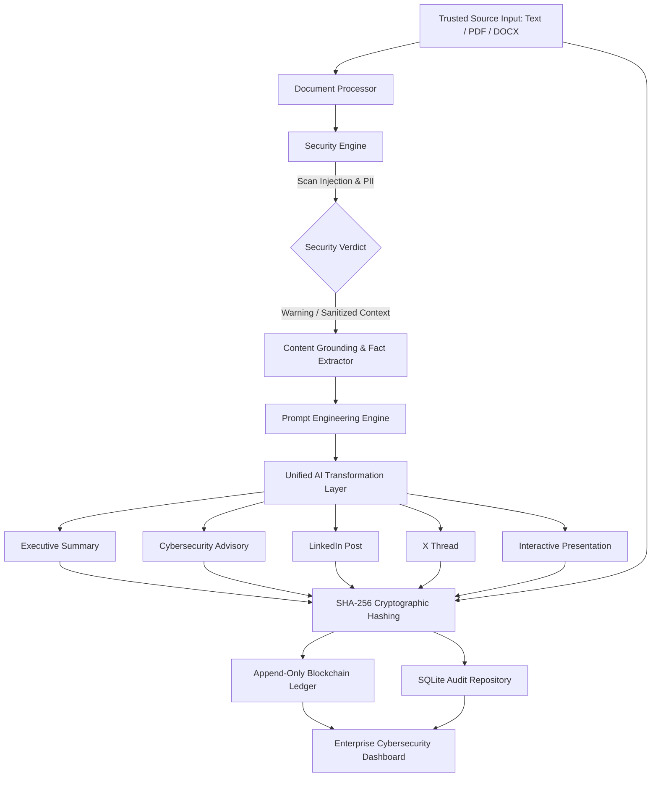

# ARCHITECTURE SPECIFICATION
**Project:** Gen AI Platform for Automated Content Transformation  
**Problem Statement ID:** 26154 | **Organization:** National Technical Research Organisation (NTRO)  
**Theme:** Blockchain & Cybersecurity  

---

## 1. System Overview

The platform transforms raw untrusted operational data into multi-channel communication artefacts through a multi-stage security, grounding, transformation, and cryptographic auditing pipeline.

---

## 2. Component Architecture

### 2.1 Ingestion Layer (`modules/document_processor.py`)
- Reads raw text or binary streams (`.txt`, `.pdf`, `.docx`).
- Extracts UTF-8 sanitized plain text.
- Validates file headers and guards against file bombing or corrupt structures.

### 2.2 Security & Threat Screening Layer (`modules/security.py`)
- **Untrusted Input Isolation:** Treats all document body content as passive data tokens rather than executable instructions.
- **Prompt Injection Defense:** Regex and pattern heuristics detect system override cues (`ignore previous instructions`, `system prompt dump`, `jailbreak`, `DAN mode`).
- **Sensitive Data Scanner:** Flags exposed PII, private keys, authorization bearer tokens, passwords, and internal IPv4/IPv6 ranges without data corruption.

### 2.3 Grounding & Anti-Hallucination Layer (`modules/content_analyzer.py` & `prompts.py`)
- Extracts an internal structured representation of entities, dates, systems, and metrics.
- Enforces strict system instructions: *"If a metric or IoC is not present in source, output 'Not specified in source' instead of inferring or hallucinating."*

### 2.4 Transformation Layer (`modules/ai_engine.py`)
- Modular provider pattern supporting Google Gemini API, OpenAI API, or local deterministic grounded fallback engine.
- Parallel or sequential generation for 5 discrete output specifications.

### 2.5 Cryptographic Ledger & Audit Layer (`modules/blockchain.py`, `hashing.py`, `history.py`)
- Calculates `SHA-256(source_text)` and `SHA-256(output_i)`.
- Records blocks containing:
  $$\text{Block} = \{ \text{index}, \text{timestamp}, \text{prev\_hash}, \text{data} = (\text{src\_hash}, \text{out\_hashes}, \text{meta}), \text{hash} = \text{SHA256}(\dots) \}$$
- Validates hash linkage on-demand; flags any ledger tampering or retroactive edits.
- Stores historical transformation records in SQLite.

---

## 3. Data Flow Specification

| Step | Operation | Input | Output / State |
|---|---|---|---|
| **1. Ingest** | Extract Text | File Buffer / Textarea | Clean Text String |
| **2. Screen** | Security Analysis | Clean Text | Security Summary, Injection Alerts, PII Flags |
| **3. Ground** | Key Fact Extraction | Clean Text | Structured Facts Object |
| **4. Transform** | Multi-LLM Routing | Prompts + Grounding | 5 Generated Artefacts |
| **5. Hash** | Cryptographic Digest | Source + Artefacts | Source SHA-256, Output SHA-256s |
| **6. Ledger** | Mint Audit Block | Digest Bundle + Prev Hash | Immutable Block Record + SQLite Row |
| **7. Display** | Visual Render | State Store | UI Tabs, Copy/Download, Slide Deck |

---

## 4. Security & Compliance Model

1. **Zero Untrusted Execution:** Prompt wrappers isolate data from system directives.
2. **Deterministic Cryptographic Trail:** Any tampering with historical inputs or outputs invalidates the blockchain hash chain.
3. **No Secret Leakage:** Environment variables strictly manage API keys; no hard-coded credentials.
4. **Honest Reporting:** Alerts accurately reflect pattern matching results without false claims of kernel-level malware scanning.
